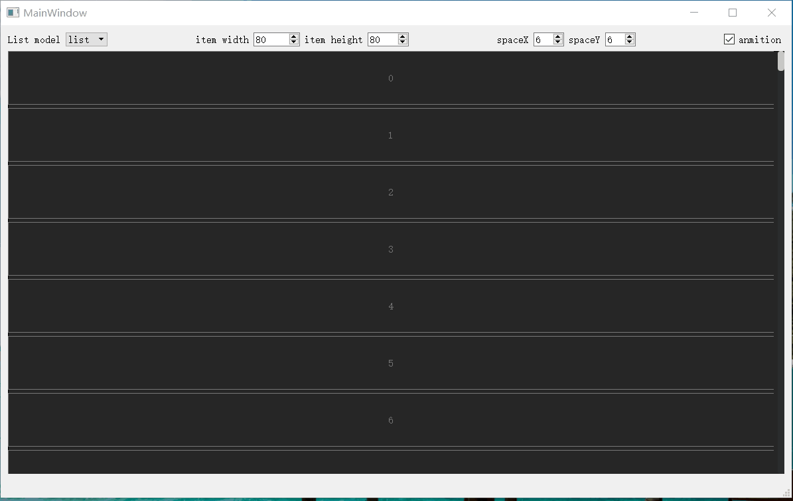

# qt_sp_animation_graphicsview

一个基于QWidget的一个简单动画视图架构

特色：基类实现了动画，子类item在任何的move或者resize都可以以动画的方式呈现。

1.关于view组织结构
     CSpGraphicView是我们的视图基类，实现了基本的函数接口，接下来的实现了动画的CSpGraphicViewAnimation视图，他的孩子item必须是继承于CSpGraphicViewAnimationItem的。
 CSpGraphicViewAnimationWidget和CSpGraphicViewAnimationListWidget是实现了如何保存子item的继承于CSpGraphicViewAnimation的视图类，这里面定义了子item是如何被view进行管理的，如CSpGraphicViewAnimationWidget是利用QMultiMap<qreal, CSpGraphicViewItem*>对孩子item进行管理， 
CSpGraphicViewAnimationListWidget是用了QList<CSpGraphicViewAnimationIndexItem*>容器对孩子item进行保存，如果需要用其他的容器数据结构对子item进行管理，可从CSpGraphicViewAnimation重载新的view进行实现(可仿照CSpGraphicViewAnimationListWidget)
 
 

2.test例子test.pro  (编译最好关掉qt creator的shadow build)
    这个例子是静态编译该框架的一个列子，同时以CSpGraphicViewAnimationListWidget为基准，通过CSpGraphicStructModel对列表进行控制，实现了基本列表(并附带了动画效果)。

3.spgraphicView.pro (编译最好关掉qt creator的shadow build)
    可一将源码编译成一个动态库，以动态库的形式提供调用.

